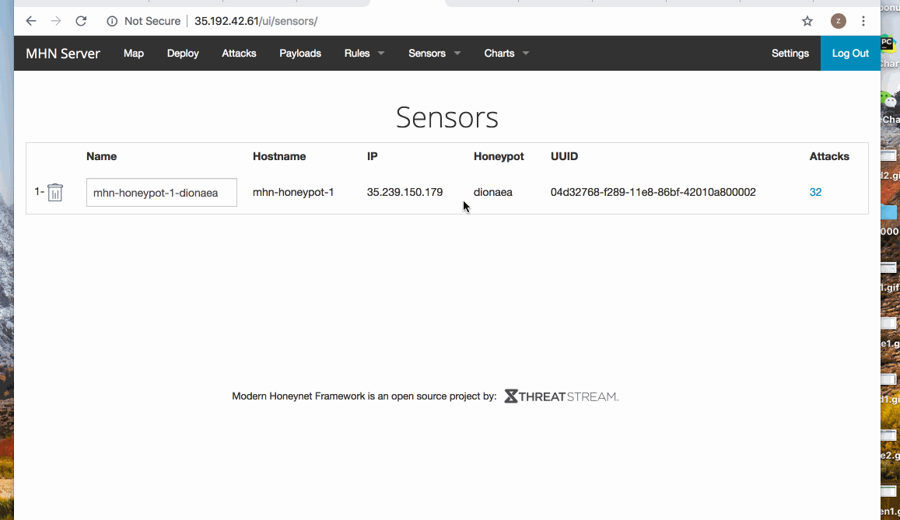
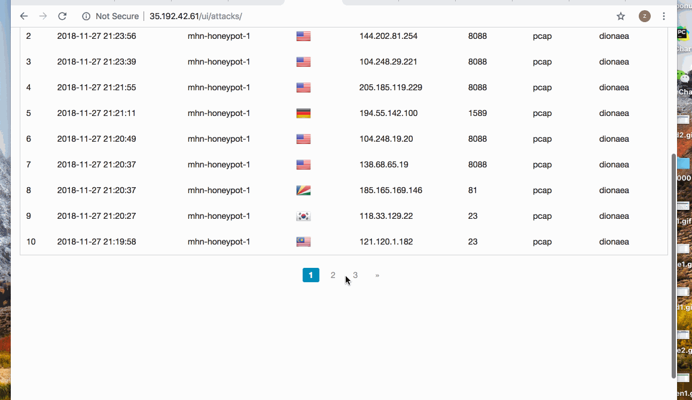
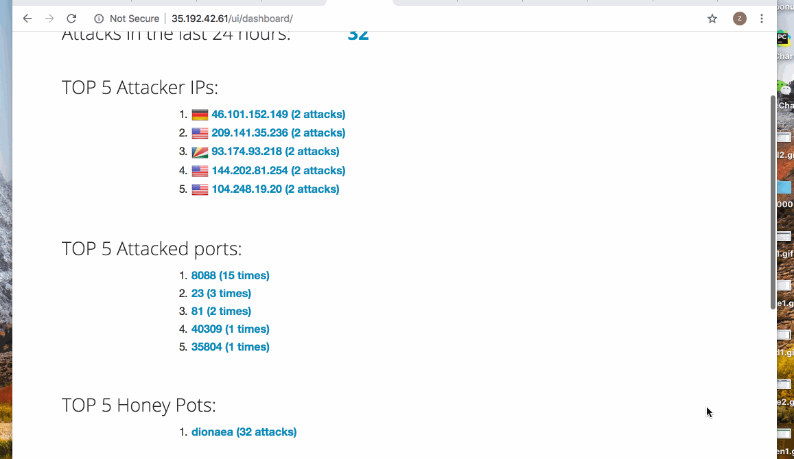

# Week9-web-security
## Which Honeypot(s) you deployed
- mhn-honeypot-1-dinoaea

## Any issues you encountered
- I spent 12 hours to figure out how to set up the honeypot 
because I meent a lot of error during install it.

## A summary of the data collected: number of attacks, number of malware samples, etc.
 - 
 - 
 - 

## Any unresolved questions raised by the data collected
 - No
